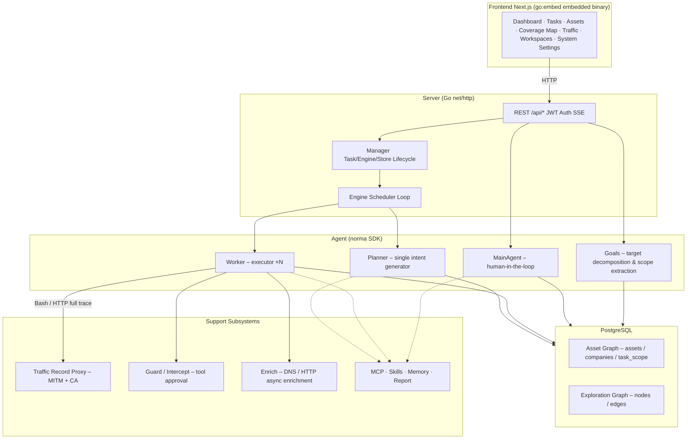

# ARTEX

AI autonomous penetration testing system (Go backend + Next.js frontend)

🌐 **Live Demo**: https://artex-demo.vercel.app/

---

## Screenshot Overview

> Full interaction see the [online demo](https://artex-demo.vercel.app/).

| Dashboard (overview / token usage / activity stream) | Task List |
| :---: | :---: |
|  |  |

| Task Execution (session / tool calls) | Exploration Graph |
| :---: | :---: |
|  |  |

| Findings | Assets |
| :---: | :---: |
|  |  |

| Asset Coverage Map (force‑directed layout, tested highlights, node collapse/expand) |
| :---: |
|  |

| Traffic Recording | Human‑in‑the‑loop Conversation |
| :---: | :---: |
|  |  |

| Agent Management | LLM Configuration |
| :---: | :---: |
|  |  |

| Intercept Approval | Backend Logs |
| :---: | :---: |
|  |  |

---

## Approval Record Details

Global "Approval Records" and task‑level "Intercept Approvals" as well as approval cards in conversations can be expanded to view details. The structure follows the component used in [AegisHook's approval detail component](https://github.com/RuoJi6/AegisHook/blob/main/web/src/components/CallDetail.vue), using ARTEX's component and theme.

---

## Asset Synchronization (ScopeSentry)

Supports direct synchronization of asset data from [ScopeSentry](https://github.com/Autumn-27/ScopeSentry), eliminating duplicate collection:
- On the **Asset Sync** page, enter the ScopeSentry address and API Key to connect the data source.
- Choose synchronization targets and asset types (domains / subdomains / IPs / ports / sites / endpoints…) by **Project** or **Task**.
- Import with one click and merge according to company asset scope, making the assets directly usable in ARTEX's asset graph for agents.

---

## Installation

> Requires **PostgreSQL** database; configure **LLM** (set `ANTHROPIC_API_KEY` or `OPENAI_API_KEY`, also configurable via UI).

### Method 1: One‑Click Install Script (recommended)

```bash
git clone https://github.com/Autumn-27/ARTEX.git
cd ARTEX
./install.sh
```
The script will:
- Detect / automatically install Docker → let you choose **① Full Docker** or **② Local Build**:
  - **① Full Docker**: Provide a Postgres password (Enter to generate random) → automatically write `.env` → `docker compose up -d`.
  - **② Local Build**: Choose a database (existing or Docker‑started) → generate `config.json` → compile the Go binary → start.
After installation, open **http://localhost:8787** (first visit go to `/setup` to set admin password).

### Method 2: Docker Compose (manual)

```bash
git clone https://github.com/Autumn-27/ARTEX.git
cd ARTEX
cp .env.example .env          # fill POSTGRES_PASSWORD, optional ANTHROPIC_API_KEY
docker compose up -d          # pulls autumn27/artex image + postgres
# → http://localhost:8787
```
The image includes common tools (ripgrep, curl, vim, npm, nmap…). `./skills` and `./data` are mounted for persistence.

### Remote MCP Configuration

You can select `http` (Streamable HTTP) or `sse` (legacy SSE) in system settings. SSE services typically use `GET /sse` to establish an event stream, then receive JSON‑RPC requests via `/message?sessionId=...`. Configure the URL as `/sse` and set the `Authorization=Bearer <token>` header.

### Method 3: Download Pre‑compiled Binaries (Releases)

Download the appropriate zip from the [Releases](https://github.com/Autumn-27/ARTEX/releases) page, unzip to obtain `artex` + `start.sh` (Windows: `start.bat`) + `skills/` + `config.example.json`:
```bash
cp config.example.json config.json   # fill database connection
./start.sh                           # → http://localhost:8787
```
> Use `start.sh` / `start.bat` to launch; do not run `./artex` directly. It is a daemon script: when the program exits, the exit code decides whether to restart. The "one‑click update" button on the page relies on this script.
> Background daemon example: `nohup ./start.sh >artex.log 2>&1 &`.

### Method 4: Build from Source (single binary)

```bash
# Frontend static export
cd web && npm ci && npm run build:static && cd ..
# Copy into embedded directory
cp -r web/out server/webui/dist
# Compile (use -tags embedui to embed frontend)
CGO_ENABLED=0 go build -tags embedui -o artex ./cmd/artex
./start.sh
```

### Method 5: Cross‑Platform Release Package

`build.sh` builds and embeds the frontend, then strips debugging info and compresses the release zip. Release mode generates Linux amd64/arm64, macOS amd64/arm64, and Windows amd64 zip packages:
```bash
./build.sh --release
# Output: dist/artex-0.3.3-*.zip
```
UPX self‑extracting binaries may be incompatible with some Linux kernels, virtualization environments, or security policies, so it is disabled by default. You can enable it with `ARTEX_TARGETS` and `--upx` when you have confirmed compatibility.

---

## Update & Upgrade

> Upgrading replaces the program without touching data: PostgreSQL volume `pgdata`, `./data` (jwt.key / SQLite etc.), and `./skills` are preserved. **Database migrations are automatic** – each start runs `schema.sql` idempotently (adds columns, creates indexes if not existing).

### Method 1: One‑Click Update via UI (recommended)

In the **System Settings** page (sidebar → `/system/settings`), the **Version & Update** card lets you check for and install new versions without logging into the server.
- Click **Update** → download the current platform's release → compare `SHA256SUMS` → smoke‑test the new binary → stage as `artex.new` → the program exits, and `start.sh` / `start.bat` automatically restarts with the new version.
- **Failure handling**: If verification or smoke test fails, the staged file is discarded and the current version continues. If the new version fails to start three consecutive times, it rolls back to `artex.old` (the failed binary remains as `artex.failed` for debugging).
- **Rollback**: The previous version is kept as `artex.old`; you can revert via the UI. Database schema does not revert.
- **Note**: Updates interrupt running tasks – perform during idle periods.
- **Docker**: Updating the container only replaces the binary, not the embedded tools; after `docker compose up -d` the container will revert to the original image versions. Use `docker compose pull artex && docker compose up -d artex` to update the image as well.
- **Proxy**: If GitHub requires a proxy, configure a **global proxy** on the same page; updates will go through it.

### Method 2: One‑Click Update Script

```bash
cd ARTEX
./update.sh
```
The script optionally runs `git pull` then lets you choose **① Docker Update** or **② Local Build Update** (mirroring `install.sh`):
- **① Docker**: Specify target image tag (Enter to use `.env`'s `ARTEX_TAG`, default `latest`) → `docker compose pull` → `docker compose up -d` (docker image swap triggers migration).
- **② Local**: Rebuild frontend static assets → re‑compile `./artex` (changes take effect after restart).

### Method 3: Manual Docker Compose Update

```bash
cd ARTEX
git pull                       # update compose / scripts (optional)
# Specify version: set ARTEX_TAG=v0.2.0 in .env, otherwise defaults to latest
docker compose pull artex
docker compose up -d artex     # swap image & restart → automatic schema migration
docker image prune -f          # optional cleanup of old images
```

### Method 4: Pre‑compiled Binary (Releases)

Download the new zip from [Releases], stop the old process, replace `artex` and `skills/` (keep your `config.json` and `data/`), then restart:
```bash
cp -r <extracted>/skills ./ && cp <extracted>/artex ./
./start.sh
```

### Method 5: Build from Source

```bash
git pull
cd web && npm ci && npm run build:static && cd ..
cp -r web/out server/webui/dist
CGO_ENABLED=0 go build -tags embedui -o artex ./cmd/artex
# Restart
./start.sh
```

---

## Configuration

**Database** (`config.json` or via `ARTEX_PG_DSN` env):
```json
{
  "database": {
    "host": "127.0.0.1",
    "port": 5432,
    "user": "artex",
    "password": "yourpass",
    "dbname": "artex",
    "sslmode": "disable"
  }
}
```
**LLM**: `export ANTHROPIC_API_KEY=sk-...` (or `OPENAI_API_KEY`), also configurable in the UI's **LLM Configuration** page.
Optional: `ARTEX_LLM_PROVIDER`, `ARTEX_LLM_MODEL`, `ARTEX_LLM_BASE_URL`, `ARTEX_LLM_PROXY`.
**Concurrency**: Number of workers per task is configurable in **System Settings** (default 3).
**Common Parameters**: `./start.sh -addr :8787 -proxy :8788` (pass directly to `artex`).

### Reverse Proxy Deployment (HTTPS / expose only 443)

Both frontend and API/SSE share the same backend port (default `:8787`). Real‑time activity stream uses the same origin, so **no need to set `NEXT_PUBLIC_SSE_BASE`**. Expose only 443 externally and keep 8787 internal.
SSE requires disabling buffering; otherwise browsers may connect but receive no events. Nginx example:
```nginx
server {
    listen 443 ssl;
    server_name your.domain.com;
    # ssl_certificate / ssl_certificate_key ...

    location / {
        proxy_pass http://127.0.0.1:8787;
        proxy_set_header Host $host;
        proxy_set_header X-Forwarded-Proto $scheme;
        # SSE critical settings:
        proxy_buffering off;
        proxy_cache off;
        proxy_read_timeout 3600s;
        proxy_http_version 1.1;
        proxy_set_header Connection "";
    }
}
```
Only set `NEXT_PUBLIC_SSE_BASE` during build if SSE must use a different origin.

---

## Development

### Manual Vulnerability Re‑testing

The "Re‑test" tab on a task’s vulnerability detail page allows pagination to select vulnerabilities, view historical conclusions/evidence, and manually launch a re‑test. After starting, the tab shows a loading spinner and "Re‑testing" status. Once a fix is confirmed, the vulnerability status updates automatically.
- Click "Re‑test" on a vulnerability row or in the detail section to open a dedicated re‑test Agent session.
- New builds include a pre‑configured "retester" Agent (`retester`) which can be customized in Agent Management (prompt, LLM, budget, tools).
- When a re‑test session finishes with "Fixed", the vulnerability state changes to "Fixed" automatically.

### Local Run & Test

```bash
./dev.sh    # backend (:8787) + traffic proxy (:8788) + frontend next dev (:5173) → http://localhost:5173
```
- Backend: `go run ./cmd/artex` (omit `-tags embedui` to not embed frontend).
- Frontend: `cd web && npm run dev` (API proxied to backend, hot reload).
- Tests: `go test ./...`
- Mock preview (no backend): `cd web && NEXT_PUBLIC_MOCK=1 npm run dev`

---

## System Architecture

ARTEX is an **LLM‑driven autonomous penetration testing system**: Go monolith backend (embedding Next.js frontend) + PostgreSQL. Agent capabilities come from the [`norma`](https://github.com/Autumn-27/norma) SDK (`agentcore`, `tool`, `permission`, `harness`, `memory`, `transcript`). The core features a **dual‑graph architecture** and two autonomous mechanisms:
- **Worker‑level process‑level information exchange**
- **Planner multi‑round shared todolist for stable attack chains**

### Overall Layers

| Layer | Responsibility |
|---|---|
| **Frontend** | Next.js static export, embedded via `go:embed`; visualizes tasks, assets, exploration graph, coverage map, human‑in‑the‑loop dialogue |
| **Server** | `net/http` routing, JWT auth, SSE; `Manager` hosts task, engine, DB store lifecycle |
| **Engine** | Per‑task `plannerLoop` + N worker goroutines; intent retrieval, timeout/pause/drain |
| **Agent** | Goals / Planner / Worker / MainAgent; `ToolSet` exposes dual‑graph to LLM tools |
| **DB** | Dual‑graph persisted in Postgres; schema rebuilt idempotently on each start |
| **Support** | MITM proxy, approval gate, async enrichment, MCP/skills/memory/report |

### Dual‑Graph Architecture
- **Asset Graph** (global shared): Nodes represent `root_domain / subdomain / ip / service / app / endpoint`, grouped by company. Parent‑child relationships and deduplication keys are computed automatically.
- **Exploration Graph** (per‑task): Nodes represent `goal / intent / fact / finding / hint`; edges (`spawns`, `derived_from`, `yields`, `proves`) form a provenance chain.
- **Anchors** link exploration nodes to specific assets, enabling both forward (what assets are being tested) and reverse (what intents/facts relate to an asset) queries. This powers asset coverage visualization and testing completeness.

---

## Community

Scan the QR code to follow the WeChat public account **SecSentry**; send a private message to join the group.


---

## References

https://github.com/oritera/Cairn

---

## License & Disclaimer

### Open Source License

This project is licensed under **GNU Affero General Public License v3.0 (AGPL‑3.0)**. See the repository root `LICENSE` file for full terms. Derivative works must also be open‑sourced under AGPL‑3.0, and if you provide the software as a network service, you must make the complete source available to users.

> **Important**: The license does not restrict usage purpose. The following usage limits and disclaimer are additional terms from the author that you must follow.

### Allowed Use
- Reading, learning, and researching the source code.
- Running locally in an isolated environment for technical verification.
- Personal learning, academic research, code review, non‑malicious purposes.

### Prohibited Actions
- Scanning, probing, exploiting, or attacking any online system or website (authorized or not).
- Using this tool for real penetration testing, red‑team engagements, or production environments.
- Illegal activities such as unauthorized intrusion, data theft, ransomware, denial‑of‑service, or any malicious behavior.
- Violating any applicable laws or regulations in your jurisdiction.

### Compliance Responsibility
You must comply with all local laws regarding cybersecurity, data protection, and computer crime. The author and contributors are not responsible for any damages, data loss, system damage, or legal consequences arising from your use of this tool.

### Disclaimer
The project is provided **AS IS**, without any express or implied warranties. The authors and contributors are not liable for any direct or indirect loss, data loss, system damage, or legal disputes resulting from any use of this tool, whether proper or improper.

---

The above content is the fully translated English version of the README.
