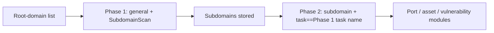

## name: scopesentry-mcp  
description: Manage the security-scanning platform (projects, tasks, templates, assets, nodes) via the ScopeSentry MCP. Use when the user mentions ScopeSentry, MCP, API Key, scan tasks, or asset queries.  

# ScopeSentry MCP User Guide  

For users of a **deployed ScopeSentry instance**. Connect to the platform with Cursor (or any other MCP client) without needing local source code.  

## 1. Preparation  

### 1.1 Verify Service Accessibility  

- Default web UI: `http://<host>`  
- MCP endpoint: `http://<host>/mcp` (if a reverse/proxy is in front, use the actual `/mcp` address)  

### 1.2 Create API Key  

1. Log in to the ScopeSentry web UI in a browser.  
2. Open the **API Key** management page and create a key (or use the admin-provided endpoint).  
3. Save the returned `ssk_...` string (**shown only once**).  

### 1.3 Configure Cursor MCP  

Cursor → Settings → MCP → Add Server:  

```json
{
  "mcpServers": {
    "scopesentry": {
      "url": "http://<your-host>:8082/mcp",
      "headers": {
        "X-API-Key": "ssk_<your-key>"
      }
    }
  }
}
```

You can also use: `Authorization: Bearer ssk_<your-key>`  

After configuring, restart or reload MCP in Cursor and verify that tools such as `list_projects`, `list_assets`, etc., appear in the tool list.  

---  

## 2. Tool Overview  

| Tool                     | Purpose |
| ------------------------ | -------------------------------------------------------------- |
| `list_projects`          | Project tree grouped by tags (includes project IDs) |
| `list_projects_data`     | Paginated project list, searchable by name |
| `get_project`            | Project details |
| `create_project`         | Create a new project |
| `list_tasks`             | Scan task list |
| `get_task`               | Task details |
| `list_scan_templates`    | Scan template list |
| `get_scan_template`      | Template details |
| `list_plugin_modules`    | Scan pipeline module names |
| `list_plugins`           | Available plugins (includes hash and default parameters) |
| `create_scan_template`   | Create a scan template |
| `create_scan_task`       | Create a scan task |
| `list_assets`            | Query various assets (paginated list) |
| `count_assets`           | Count assets (`/api/assets/common/total`) |
| `get_asset_detail`       | Asset or vulnerability details |
| `add_asset_tag`          | Add a tag to an asset |
| `list_nodes`             | Scan node list |

Tool parameters follow the MCP tool schema. The `search` and `filter` syntax for `list_assets` / `count_assets` is identical; read the `list_assets` description before querying assets.  

Use `count_assets` when you only need the total number (matches the web pagination total endpoint) instead of paging through `list_assets`.  

---  

## 3. Common Workflows  

### 3.1 Query Assets by Project  

When the user or context already has a project condition, include `filter.project` to narrow the scope and avoid slow responses caused by cross-project data. If no specific project is known, the filter can be omitted.  

1. Use `list_projects` or `list_projects_data` to obtain the target project's **ObjectID** (`id` / `children[].value`).  
2. Call `list_assets` with `filter.project` (**must be the ID, not the project’s Chinese name**).  

```json
{
  "asset_type": "asset",
  "pageIndex": 1,
  "pageSize": 20,
  "search": "domain=^example.com",
  "filter": {
    "project": ["<ProjectObjectID>"]
  }
}
```

### 3.2 Create a Scan Task  

1. Use `list_nodes` to get the names of online nodes.  
2. Use `list_scan_templates` or `create_scan_template` to obtain the template **ObjectID**.  
3. Call `create_scan_task`: `name` and `node` are required; `template` must be the template ID (not the name).  

**Target source `targetSource` (identical to the web UI):**  

| targetSource | Description | Required parameters |
| ------------ | ----------- | ------------------- |
| `general`    | Directly input targets | `target` |
| `project`    | Read targets from a project | `project` (array of project ObjectIDs) |
| `asset`      | Search the web asset library | `search`; optional `project`, `filter`, `targetNumber` |
| `RootDomain` | Search the root-domain library | `search`; optional `project`, `filter`, `targetNumber` |
| `subdomain`  | Search the subdomain library | `search`; optional `project`, `filter`, `targetNumber` |
| `UrlScan`    | Search URL scan results | `search`; optional `project`, `filter`, `targetNumber` |
| `*Source` (e.g., `subdomainSource`) | Create from asset page “selected / searched” | Use `search` when `targetTp=search`; use `targetIds` when `targetTp=select` |

**Example: Direct root-domain scan:**  

```json
{
  "name": "example-subdomain-collection",
  "node": ["node-1"],
  "template": "<TemplateObjectID>",
  "targetSource": "general",
  "target": "example.com\nfoo.com",
  "project": ["<ProjectObjectID>"]
}
```

**Example: Follow-up scan from subdomain library (filter by previous task name):**  

```json
{
  "name": "example-ports-and-vulns",
  "node": ["node-1"],
  "template": "<FollowUpModuleTemplateObjectID>",
  "targetSource": "subdomain",
  "search": "task==\"example-subdomain-collection\"",
  "project": ["<ProjectObjectID>"]
}
```

### 3.3 Full Information Gathering for a Root Domain (Recommended Two-Stage)  

When the input is a **root domain** and you need comprehensive data collection, split the scan into two phases rather than running the entire pipeline at once.  

**Why:** Distributed tasks are dispatched per **single target**. If a node receives a root domain, the subdomains discovered on that node will also be processed by the same node, leading to load imbalance, slower speed, and higher error rates.  

**Best practice:**  

1. **Phase 1: Subdomain collection only**  
   - `targetSource`: `general`  
   - `target`: all root domains (one per line)  
   - Template: enable only `SubdomainScan` and `SubdomainSecurity` (subdomain discovery + takeover)  
   - Use `get_task` to wait for completion  

2. **Phase 2: Subsequent modules**  
   - `targetSource`: `subdomain`  
   - `search`: `task=="<Phase 1 task name>"` (exact match)  
   - Optional `project` to narrow scope  
   - Template: port scanning, asset mapping, vulnerability scanning, etc. (may omit `SubdomainScan`)  
   - Subdomains are distributed as independent targets across nodes, improving parallel efficiency  

The same effect can be achieved via the web UI: filter the “subdomain” asset page by task name and click “Create task from subdomains”.  



### 3.4 Create a Scan Template  

1. Call `list_plugin_modules` → obtain module names.  
2. Call `list_plugins` (optionally filter by `module`) → get each plugin’s `hash` and default `parameter`.  
3. Call `create_scan_template` and use the `modules` field to specify “module → array of plugin hashes”.  

---  

## 4. Asset Query (`list_assets` / `count_assets`)  

`count_assets` shares the same `asset_type`, `search`, and `filter` fields as `list_assets` and returns `{ "total": N }`, matching the web endpoint `/api/assets/common/total`.  

```json
{
  "asset_type": "subdomain",
  "search": "task==\"SomeTaskName\"",
  "filter": { "project": ["<ProjectObjectID>"] }
}
```

**Performance tips (apply to both `list_assets` and `count_assets`):**  
- When a project condition is available, always use `filter.project` to reduce the search space.  
- In `search`, use `==` (exact) or `^` (prefix) on indexed fields (see section 4.3) rather than the fuzzy `=` operator, which bypasses indexes and can be slow on large tables.  
- If no project context exists, do not force a project filter.  

Supported `filter.project` types are listed in the table of section 4.4.  

### 4.1 Asset Types (`asset_type`)  

- `asset`, `RootDomain`, `subdomain`, `app`, `mp`, `UrlScan`, `SensitiveResult`, `DirScanResult`, `crawler`, `vulnerability`, `PageMonitoring`, `IPAsset`, `SubdomainTakerResult`  

Aliases (examples): `web` → `asset`, `vuln` → `vulnerability`, `ip` → `IPAsset`, `url` → `UrlScan`.  

### 4.2 Parameter Summary  

| Parameter | Meaning |
| --------- | --------------------------------------------------- |
| `pageIndex` / `pageSize` | Pagination, defaults 1 / 20 |
| `search` | Search expression (see next section) |
| `filter` | Exact-match JSON filter (see next section) |
| `sort` | Only supported by **UrlScan** and **DirScanResult** (sort by `length`) |
| `sid` | Only for **SensitiveResult**: name of the sensitivity rule |

`search` and `filter` **can be used together**.  

### 4.3 `search` Expression  

Custom DSL ( **not SQL** ):  

| Operator | Meaning | Index usage | Example |
| -------- | ------- | ----------- | ------- |
| `=`  | Fuzzy (regex) match | No index | `domain=example` |
| `==` | Exact match | **Uses index** | `port==443` |
| `!=` | Not equal | - | `port!="80"` |
| `&&` | AND | - | `domain==example.com && port==443` |
| `||` | OR | - | `title=admin || body=login` |

**Indexable fields:** `domain`, `ip`, `port`, `title`, etc. Only **`==`** or **prefix `^`** (e.g., `domain=^example.com`) can leverage indexes. The fuzzy `=` operator compiles to a regex and does **not** use indexes, which can be slow on large datasets.  

**Common searchable fields for all types:** `tag`, `task` (task name), `rootDomain`.  

Do **not** place `project` in `search` (it is ignored or causes errors when combined with `&&`). Use `filter.project` instead.  

**Typical searchable fields per asset type:**  

| asset_type | Fields |
| ---------- | ------------------------------------------------------------ |
| asset | domain, ip, port, service, app, title, statuscode, icon, banner, type, body, header |
| RootDomain | domain, icp, company |
| subdomain | domain, ip, type, value |
| app | name, icp, company, category, description, url, apk |
| mp | name, icp, company, category, description, url |
| UrlScan | url, input, source, resultId, type |
| SensitiveResult | url, sname, body, info, md5 |
| DirScanResult | url, statuscode, redirect, length |
| vulnerability | url, vulname, matched, request, response, level |
| crawler | url, method, body, resultId |
| PageMonitoring | url, hash, diff, response |
| IPAsset | ip, domain, port, service, webServer, app |
| SubdomainTakerResult | domain, value, type, response |

**Search examples:**  

- `domain==www.example.com && port==443` (exact, indexed)  
- `domain=^example.com` (prefix, indexed)  
- `ip==192.168.1.1`  
- `task=="SomeTaskName"`  
- `level==high` (vulnerability)  
- `statuscode==200` (DirScanResult)  

Use `=` only for fuzzy containment, e.g., `title=admin` (non-indexed, combine with project filter to limit scope).  

### 4.4 `filter` Exact Filtering  

JSON object where multiple values for the same key are **OR**, different keys are **AND**.  

**When a project condition exists, prefer `filter.project`:** obtain the ObjectID via `list_projects` / `list_projects_data`. If no project info is available, omit the filter.  

| filter key | Meaning | Value format |
| ---------- | ------- | ------------ |
| `project` | Belonging project | **ObjectID** (from project list) |
| `task` | Source task | **Task name** (from `list_tasks` `name`) |
| `port` | Port | e.g., `"443"` |
| `service` | Service / protocol | e.g., `"https"` |
| `app` | Application fingerprint | e.g., `"Nginx"` |
| `icon` | Icon hash | - |
| `statuscode` | HTTP status code | Primarily for `asset` |
| `status` | Status | UrlScan/DirScan HTTP code; vulnerability/sensitivity handling status |
| `level` | Vulnerability severity | `critical` / `high` / `medium` / `low` / `info` |
| `type` | Record type | e.g., A, CNAME for subdomains |
| `color` | Sensitivity rule color | SensitiveResult |
| `sname` | Sensitivity rule name | SensitiveResult |
| `tags` | Tags | - |

**Available filter keys per asset type:**  

| asset_type | filter keys |
| ---------- | ------------------------------------------------------------ |
| asset | project, port, service, app, icon, statuscode, type, task, tags |
| RootDomain | project, tags |
| subdomain | project, type, task, tags |
| app / mp | project, tags |
| UrlScan | status, tags |
| DirScanResult | status, tags |
| SensitiveResult | status, color, sname, tags |
| crawler | project, task, tags |
| vulnerability | project, level, status, task, tags |
| PageMonitoring / SubdomainTakerResult | tags |
| IPAsset | project, port, service, app |

**Filter example:**  

```json
{ "project": ["<ProjectObjectID>"], "port": ["443"] }
```

**Combined query example:**  

```json
{
  "asset_type": "asset",
  "search": "domain=^baidu && port==443",
  "filter": { "project": ["<ProjectObjectID>"] },
  "pageIndex": 1,
  "pageSize": 10
}
```

**Notes:**  

- Prefer `filter.project` when possible; do **not** use the project’s display name.  
- Use `==` for known values, `^` for prefix matches; avoid heavy `=` fuzzy matches on large tables.  
- For UrlScan HTTP status, use `filter.status`; for DirScanResult you can also filter with `search` using `statuscode==200`.  
- For SensitiveResult, filter by rule name with `search` (`sname=RuleName`) or `filter.sname`.  

### 4.5 Sorting (`sort`)  

Only **UrlScan** and **DirScanResult** support sorting:  

```json
{ "length": "ascending" }
```

Other asset types ignore `sort` and are ordered by creation time by default.  

---  

## 5. Scan Template Module Names  

`TargetHandler`, `SubdomainScan`, `SubdomainSecurity`, `PortScanPreparation`, `PortScan`, `PortFingerprint`, `AssetMapping`, `AssetHandle`, `URLScan`, `WebCrawler`, `URLSecurity`, `DirScan`, `VulnerabilityScan`, `PassiveScan`  

---  

## 6. Troubleshooting  

| Symptom | Remedy |
| -------- | ---------------------------------------------------- |
| No tools in MCP | Check the URL, API Key, and that ScopeSentry is running |
| 401 / 403 | Re-create or replace the API Key |
| Asset not found | Ensure `filter.project` uses the ObjectID; do not place `project` in `search` |
| Template / task creation fails | `template` must be a template ObjectID; `node` must be an online node name |
| Query is slow / hangs | Add `filter.project` when possible; use `==` or `^` on indexed fields instead of `=`; reduce `pageSize` |
